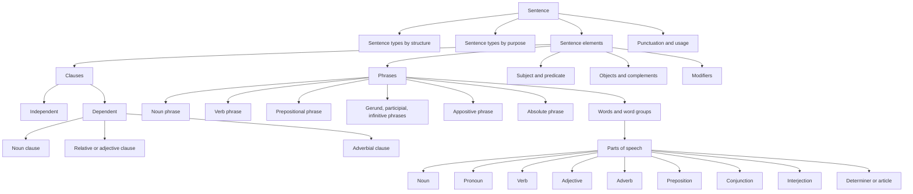

# Comprehensive Taxonomy of High School English Grammar Terms

## Executive summary

A strong U.S. high-school grammar taxonomy should be broader and more explicit than the list you started with. In current secondary standards and teacher-facing references, the indispensable core is not just “parts of speech, subjects/predicates, clauses, phrases, complements, and four sentence types.” It also includes specific phrase and clause subtypes; object and complement labels; modifier categories; agreement; tense, aspect, and voice; sentence-boundary errors; and punctuation categories tied directly to grammar, especially commas, semicolons, colons, dashes, parentheses, apostrophes, and hyphens. Common Core for grades 9–10 explicitly names phrase types such as noun, verb, adjectival, adverbial, participial, prepositional, and absolute, and clause types such as independent, dependent, noun, relative, and adverbial; Texas high-school TEKS likewise requires parallel constructions, dependent clauses, complete sentences, avoidance of splices/run-ons/fragments, consistent verb tense, active and passive voice, pronoun-antecedent agreement, and punctuation that sets off phrases and clauses. citeturn7view0turn22view1

Your current list is fundamentally sound, but it is too compressed for classroom use. The biggest corrections are these. “Complements” needs subdivision into subject complement, predicate nominative, predicate adjective, and, in many classrooms, object complement. “Phrases” and “clauses” should not remain umbrella labels; high-school instruction normally splits them into named subtypes. “Four sentence types” is ambiguous unless you separate **types by structure** from **types by purpose**. And “eight parts of speech” is still a valid traditional school-grammar frame, but many modern descriptions and some classroom materials also teach **determiners/articles** as their own class or as a cross-category that overlaps with traditional adjectives. citeturn17view2turn17view1turn17view0turn7view0turn24search0turn24search1

The uploaded coverage brief confirms several of these weak spots. It already recognizes a separate **determiner** label, but it keeps phrase and clause layers flat, leaves **complement** undivided, and notes gaps such as missing **object of the preposition**, missing tense/voice/mood labels, and absent deeper phrase/clause drill-down. Those are exactly the places where authoritative high-school grammar sources would expand the taxonomy. fileciteturn0file0

What follows is a classroom-focused hierarchy and glossary that distinguishes **Essential** terms from **Advanced** ones. “Essential” here means terms that are strongly supported by major secondary standards and routinely useful in reading/writing instruction; “Advanced” means terms that are still common and worth teaching, but more likely to appear in honors/AP, sentence-combining, stylistics, or diagramming contexts, or in textbooks that use a richer grammatical metalanguage. That classification is an inference from standards and teaching references rather than a national rule, because Common Core itself notes that usage is partly conventional and sometimes contested. citeturn7view1turn15view0turn22view1

## Scope and authority

This taxonomy is built by triangulating several kinds of authority instead of relying on any single grammar tradition. The most important anchors are the Common Core high-school Language standards, the Texas high-school ELAR TEKS, NCTE’s *Grammar Alive!*, and official MLA and Chicago guidance on restrictive and nonrestrictive modifiers and appositives. Those sources are especially useful because they combine classroom relevance with reasonably explicit terminology. Common Core grades 9–10 requires students to use named phrase and clause types and parallel structure; Common Core grades 11–12 emphasizes that usage conventions can shift and be contested; TEKS specifies sentence-boundary control, tense, voice, agreement, punctuation, and dependent clauses; NCTE’s glossary gives a practical school-grammar vocabulary; MLA and Chicago show where grammar labels matter for meaning and punctuation. citeturn7view0turn7view1turn22view1turn15view0turn0search0turn0search1turn1search3turn1search5

For classroom framing, Khan Academy is also helpful because its grammar course mirrors the kinds of categories students actually encounter in U.S. secondary instruction: parts of speech, syntax, sentence types, agreement, fragments/run-ons, dangling modifiers, and punctuation. I use it here mainly as a pedagogy-oriented cross-check, not as the top authority where state standards or NCTE provide more explicit definitions. citeturn11search1turn23search1turn23search5turn27search8

One important caution: there is no single nationally mandated terminology list. NCTE explicitly frames grammar teaching as a field with multiple theories and competing traditions, and Common Core 11–12 likewise says usage is conventional and sometimes contested. That is why this report flags variable labels instead of pretending the field is perfectly uniform. citeturn15view0turn7view1

## Corrections and gap analysis for the attached list

If the intended attachment is the uploaded coverage brief, the corrections below apply directly to that taxonomy. If you meant some other attachment, the same corrections still apply wherever the same broad categories appear. The uploaded brief describes four span-label layers—parts of speech, sentence parts, phrases, and clauses—and eight whole-sentence badges; it also self-identifies complement, preposition, and phrase/clause flattening as thin spots. fileciteturn0file0

### High-priority corrections

| Current item or likely label | Correction or expansion | Why this matters in high school | Status |
|---|---|---|---|
| **Eight parts of speech** | Keep the traditional eight if you want, but add a note that many modern grammars also teach **determiners/articles** separately; some school resources still treat articles as a kind of adjective. | Students will meet both systems. Common Core and modern grammar references often work comfortably with determiners, while traditional school grammar often folds articles into adjectives. citeturn17view0turn24search0turn24search1 | **Variable terminology** |
| **Complements** | Subdivide into **subject complement**, **predicate nominative**, **predicate adjective**, and **object complement**. | NCTE explicitly distinguishes these, and they are necessary for linking-verb analysis and for diagramming. citeturn17view1turn17view2turn18view3 | **Essential** |
| **Clauses** | Split into **independent**, **dependent/subordinate**, **relative/adjective**, **adverbial**, and **noun/nominal** clauses. | Common Core 9–10 explicitly lists these clause types. NCTE also defines relative and subordinate clauses and nominal clauses. citeturn7view0turn17view3turn19view3turn29view2 | **Essential** |
| **Phrases** | Split into **noun phrase**, **verb phrase**, **prepositional phrase**, **participial phrase**, **gerund phrase**, **infinitive phrase**, **appositive phrase**, and **absolute phrase**. | Common Core 9–10 explicitly lists most of these; NCTE gives definitions and classroom examples. citeturn7view0turn20view4turn17view4turn20view0turn29view4 | **Essential** |
| **Simple/complete subjects and predicates** | Add **compound subject**, **compound predicate**, and **understood subject** for imperatives. | These show up constantly in sentence analysis and are especially helpful when teaching sentence combining and commands. Khan and NCTE both support the underlying distinctions. citeturn24search2turn19view4 | **Essential** |
| **Sentence parts** | Add **object of preposition**, **appositive**, **modifier**, **misplaced modifier**, **dangling modifier**, and **parallel structure**. | These are among the most teachable and testable syntax concepts in high school writing. TEKS and Common Core explicitly stress parallel structure and sentence control. citeturn22view1turn7view0turn23search1 | **Essential** |
| **Four sentence types** | Split into **types by purpose** and **types by structure**. | Many classrooms teach two different “sets of four,” and students confuse them unless both axes are named. Khan’s syntax sequence presents both. citeturn11search4turn27search2 | **Essential** |
| **Verb** only as a broad part of speech | Add **linking/helping/modal/transitive/intransitive/regular/irregular** plus **tense**, **aspect**, **voice**, and at least a brief treatment of **mood**. | TEKS requires tense and active/passive voice; Common Core requires phrase/clause variety and syntax; NCTE defines modals, finite/nonfinite verbs, and verbals. citeturn22view1turn11search7turn21view4turn29view2turn29view3 | **Essential** |
| **No punctuation/usage layer** | Add grammar-linked punctuation and usage terms: **comma**, **semicolon**, **colon**, **dash**, **parentheses**, **apostrophe**, **hyphen**, **fragment**, **run-on**, **comma splice**. | These are part of high-school grammar instruction in both standards and practical writing handbooks. citeturn7view1turn22view1turn21view0turn23search4turn27search9 | **Essential** |

### Relationship map

The hierarchy below matches how the terminology naturally nests in classroom instruction. Common Core 9–10 and NCTE both implicitly support this “word class → phrase/clause → sentence element → sentence type → punctuation/usage” progression. citeturn7view0turn15view0

## Hierarchical taxonomy table

The table below is the “clean hierarchy” version: broad categories first, then the subcategories a high-school classroom usually needs.

| Main group | Core subgroups | Frequently taught subterms | Priority |
|---|---|---|---|
| **Parts of speech** | Noun | common, proper, collective, concrete, abstract, possessive | Essential citeturn26search0turn26search4turn26search7 |
|  | Pronoun | personal, possessive, reflexive, emphatic, relative, interrogative, demonstrative, indefinite, antecedent | Essential citeturn25search0turn25search1turn25search2turn25search5turn23search7 |
|  | Verb | action, linking, helping/auxiliary, modal, transitive, intransitive, regular, irregular, tense, aspect, voice, mood, finite/nonfinite, verbal | Essential with some advanced extensions citeturn11search7turn27search6turn21view4turn29view2turn29view3 |
|  | Adjective | descriptive, proper, possessive, demonstrative, comparative, superlative, article/determiner overlap | Essential citeturn24search1turn24search4turn24search0 |
|  | Adverb | manner, time, place, degree, frequency, relative adverb | Essential citeturn24search1turn17view3 |
|  | Preposition | simple, phrasal/compound, object of preposition, prepositional phrase | Essential; some subtype labels advanced citeturn11search0turn20view1 |
|  | Conjunction | coordinating, subordinating, correlative | Essential citeturn11search0turn11search5turn11search6 |
|  | Interjection | expressive insertions; usually low-priority for syntax | Basic/Essential but light emphasis citeturn15view0 |
|  | Determiner or article | definite, indefinite, demonstrative, possessive, quantifier | Advanced/variable label in U.S. school contexts citeturn17view0turn24search0turn24search1 |
| **Phrase types** | Noun phrase | includes head noun plus modifiers/determiners | Essential citeturn20view4turn18view2 |
|  | Verb phrase | finite or nonfinite verb string with auxiliaries/complements | Essential citeturn29view3 |
|  | Prepositional phrase | preposition + object | Essential citeturn20view1 |
|  | Participial phrase | nonfinite verbal functioning adjectivally | Essential citeturn20view0turn20view3 |
|  | Gerund phrase | nonfinite verbal functioning nominally | Essential citeturn29view2turn29view4 |
|  | Infinitive phrase | *to* + base verb, functioning nominally/adjectivally/adverbially | Essential citeturn19view4turn29view2 |
|  | Appositive phrase | noun phrase that renames another noun | Essential citeturn18view0turn1search3 |
|  | Absolute phrase | detached noun phrase + modifier, sentence-level detail | Advanced but common in strong high-school writing instruction citeturn17view4turn7view0 |
| **Clause types** | Independent clause | can stand alone as a sentence | Essential citeturn19view4turn7view0 |
|  | Dependent clause | cannot stand alone | Essential citeturn23search5turn27search8 |
|  | Subordinate clause | usually adverbial in NCTE glossary use | Essential but label varies | citeturn19view3 |
|  | Relative or adjective clause | modifies a noun; introduced by relative pronoun/adverb | Essential citeturn17view3turn24search9 |
|  | Noun or nominal clause | clause functioning as a noun phrase | Essential/Advanced depending on course | citeturn29view2 |
|  | Adverbial clause | clause functioning as adverbial modifier | Essential citeturn19view3turn7view0 |
| **Sentence elements** | Subject | simple, complete, compound, understood | Essential citeturn24search2turn19view4 |
|  | Predicate | simple, complete, compound | Essential citeturn24search2turn19view4 |
|  | Objects | direct, indirect, object of preposition | Essential citeturn24search2turn18view3turn20view1 |
|  | Complements | subject complement, predicate nominative, predicate adjective, object complement | Essential citeturn17view1turn17view2turn18view3 |
|  | Modifiers | adjective/adverb modifiers, restrictive/nonrestrictive modifiers, appositives, dangling/misplaced modifiers, parallel structure | Essential, with some advanced labels citeturn18view1turn0search0turn0search1turn1search3turn23search1 |
| **Sentence types** | By purpose | declarative, interrogative, imperative, exclamatory | Essential citeturn11search4turn27search2 |
|  | By structure | simple, compound, complex, compound-complex | Essential citeturn11search4turn24search7 |
| **Punctuation and usage** | Sentence boundaries | fragment, run-on, comma splice | Essential citeturn21view0turn23search1 |
|  | Clause-linking punctuation | comma, semicolon, colon, dash, parentheses | Essential citeturn7view1turn22view1turn23search0turn23search2turn23search4 |
|  | Possession and contraction | apostrophe | Essential citeturn27search9turn0search5 |
|  | Word-joining punctuation | hyphen | Essential/Advanced depending on course | citeturn7view1 |
| **Diagramming terms** | Reed–Kellogg basics | main line/baseline, vertical divider, diagonal modifier line, dashed conjunction/clause line, pedestal for clause/infinitive structures | Advanced and optional | citeturn30view0turn30view1turn30view2turn30view3 |

## Classroom glossary and teaching notes

### Parts of speech and word-level categories

**Legend:** **Essential** = should appear in most high-school English courses. **Advanced** = still common and useful, but more variable by textbook/course level. The “Sources” column identifies the reference base for the row.

| Term | Definition | Priority | Teaching note and example | Common misconception | Sources |
|---|---|---:|---|---|---|
| **Noun** | A word naming a person, place, thing, or idea; in modern descriptions, the head of a noun phrase. | Essential | Example: *city*, *Jordan*, *justice*. Teach students to distinguish a noun’s meaning from its job in a sentence. | Students often think nouns are only concrete “things.” | citeturn26search0turn20view4 |
| **Common noun** | General name for a class of things. | Essential | *river*, *teacher*, *planet*. | Students capitalize common nouns too often. | citeturn26search4 |
| **Proper noun** | Specific named person, place, institution, or title needing capitalization. | Essential | *Chicago*, *Mount Kilimanjaro*. | Students confuse “specific” with “important”; not every important noun is proper. | citeturn26search4 |
| **Collective noun** | Singular-form noun naming a group considered as a unit. | Essential | *team*, *committee*, *family*. Use it when teaching agreement. | Students assume collective nouns are always plural. MLA notes singular or plural agreement can depend on whether the group acts as a unit or as individuals. | citeturn0search6 |
| **Concrete noun** | Noun naming a physical, perceivable thing. | Essential | *pencil*, *dog*, *ice cream cone*. | Students sometimes call all visible nouns “proper nouns.” | citeturn26search7 |
| **Abstract noun** | Noun naming an idea, state, quality, or concept. | Essential | *freedom*, *sadness*, *permission*. | Students often treat abstract nouns as adjectives because they “describe ideas.” | citeturn26search7 |
| **Possessive noun** | Noun marked to show possession or close association. | Essential | *the teacher’s desk*, *the teachers’ lounge*. | Students confuse possessive nouns with simple noun modifiers like *teachers college*; MLA, following Chicago in many cases, cautions that attributive-noun forms and possessives are not identical. | citeturn0search5 |
| **Pronoun** | Word that stands in for a noun or noun phrase. | Essential | Use pronouns to reduce repetition: *Emma laughed because she was nervous.* | Students think every short word is a pronoun; function matters. | citeturn25search6 |
| **Antecedent** | The word or phrase a pronoun refers back to. | Essential | In *Maria lost her keys*, *Maria* is the antecedent of *her*. | Students often identify the nearest noun rather than the actual referent. | citeturn23search7 |
| **Personal pronoun** | Pronoun showing person, number, and often case: *I, me, she, them*. | Essential | Good for teaching subject/object forms. | Students overuse object forms in compound subjects: *Me and him went*. | citeturn25search0turn25search1 |
| **Possessive pronoun** | Pronoun showing ownership: *mine, yours, theirs*. | Essential | Contrast with possessive determiner: *my book* vs. *the book is mine*. | Students treat possessive pronouns and possessive adjectives as interchangeable categories in all textbooks. | citeturn25search0turn25search1 |
| **Reflexive pronoun** | Pronoun used when subject and object refer to the same entity: *myself, herself*. | Essential | *I saw myself in the mirror.* | Students use reflexives as fancy substitutes for object pronouns: *Please send the email to myself*. | citeturn25search2 |
| **Emphatic pronoun** | Reflexive-form pronoun used for emphasis rather than object function. | Advanced | *I myself disagree.* | Students confuse emphatic with reflexive use. | citeturn25search0turn25search1 |
| **Relative pronoun** | Pronoun introducing a relative clause: *who, whom, whose, that, which*. | Essential | *The student who won smiled.* | Students overgeneralize “which for things, who for people” without noticing the role of *that* or style differences in restrictive clauses. | citeturn17view3turn25search5turn1search5 |
| **Interrogative pronoun** | Pronoun used to ask questions: *who, whom, what, which*. | Essential | *Who is calling?* | Students confuse interrogative pronouns with relative pronouns because many forms overlap. | citeturn19view4 |
| **Indefinite pronoun** | Pronoun with non-specific reference: *someone, anyone, everybody, none*. | Essential | Useful for agreement instruction. | Students often mismatch number in pronoun-antecedent agreement. | citeturn25search0turn23search7 |
| **Demonstrative pronoun or determiner** | *this, that, these, those* as stand-alone pronouns or noun markers. | Essential/Variable | *This is mine* vs. *this book*. | Students think the word has one fixed part of speech regardless of function. | citeturn24search1turn17view0 |
| **Verb** | Word expressing action, occurrence, or state; the head of the predicate. | Essential | *run*, *seem*, *be*. Teach students to connect verb choice to sentence pattern. | Students think verbs are only “action words,” which hides linking verbs and auxiliaries. | citeturn11search7turn19view4 |
| **Action verb** | Verb naming an action performed or experienced. | Essential | *throw*, *write*, *believe*. | Students misclassify all vivid words as action verbs. | citeturn11search7 |
| **Linking verb** | Verb linking the subject to a complement rather than taking a direct object. | Essential | *The soup tastes salty.* | Students try to force a direct object after *be*, *seem*, *become*, *look*. | citeturn17view1turn19view4 |
| **Helping verb or auxiliary** | Verb helping form tense, aspect, voice, or mood: *be, have, do* and modals. | Essential | *has written*, *is singing*, *did go*. | Students often call the whole verb string “the verb” without seeing auxiliaries. | citeturn21view4turn29view3 |
| **Modal** | Auxiliary expressing likelihood, ability, permission, obligation, or similar mood: *can, could, should, must*. | Essential | *You should revise.* Useful bridge to mood and nuance. | Students confuse modal meaning with tense. | citeturn21view4turn27search6 |
| **Transitive verb** | Verb taking a direct object. | Essential | *She wrote a letter.* | Students think a verb is transitive or intransitive forever; many verbs can do both depending on use. | citeturn17view1turn18view3 |
| **Intransitive verb** | Verb not taking a direct object. | Essential | *He arrived early.* | Students search for objects where the verb does not license one. | citeturn19view4 |
| **Regular verb** | Verb forming past tense and past participle in the standard *-ed* pattern. | Essential | *walk / walked / walked*. | Students assume all past forms ending in *-ed* indicate past time even when used as participles. | citeturn28view3turn20view0 |
| **Irregular verb** | Verb forming past tense or participle outside the standard *-ed* pattern. | Essential | *go / went / gone*; *sing / sang / sung*. | Students substitute the wrong participle after auxiliaries: *have went*. | citeturn11search7turn28view3 |
| **Tense** | Verb form or construction locating action in time. | Essential | Present and past are overtly marked in English finite verbs; future is usually expressed with auxiliaries. | Students equate every time meaning with a tense label. English school grammar often teaches “future tense,” but structurally it is usually a future-time construction with auxiliaries. | citeturn28view2turn29view3 |
| **Aspect** | Verb construction showing whether action is simple, ongoing, completed, or ongoing up to a point. | Essential | *writes*, *is writing*, *has written*, *has been writing*. | Students confuse aspect with tense. | citeturn11search7turn29view1 |
| **Voice** | Relationship between grammatical subject and action, usually active vs. passive. | Essential | *The mechanic fixed the car* vs. *The car was fixed by the mechanic*. | Students treat passive voice as always wrong; NCTE explicitly presents it as a rhetorical option, not an automatic error. | citeturn21view4turn15view0 |
| **Mood** | Verb form or auxiliary-based meaning showing statement, command, wish, possibility, obligation, or similar stance. | Advanced/Essential bridge | In high school, teach at least **indicative**, **imperative**, and modal-based nuance; add **subjunctive** for advanced classes. | Students confuse mood with emotion. | citeturn21view4turn19view4 |
| **Finite verb** | Verb marked for tense and agreeing position in the verb phrase. | Advanced | In *She has written*, *has* is the finite verb. | Students assume the last verb is always the finite verb. | citeturn29view3 |
| **Nonfinite verb** | Verb form not marked for tense, such as infinitive, participle, or gerund. | Advanced | Useful when teaching verbals. | Students think nonfinite forms can stand alone as the main verb of a clause. | citeturn29view2turn29view3 |
| **Verbal** | Traditional school term for gerund, participle, and infinitive. | Essential/Advanced | Helpful because many high-school textbooks still use it. | Students think verbals behave only like verbs; in fact they often function as nouns, adjectives, or adverbs. | citeturn29view2turn29view4 |
| **Adjective** | Word functioning as a noun modifier. | Essential | *blue bike*, *difficult problem*. | Students sometimes label every descriptive word “adjective,” including adverbs modifying adjectives. | citeturn24search4turn18view1 |
| **Article** | Marker such as *a, an, the* marking specificity or definiteness. | Essential | *the elephant* vs. *an elephant*. | Students need to know that some teachers call articles a type of adjective, while others call them determiners. | citeturn24search0turn24search1turn17view0 |
| **Determiner** | Word opening or specifying a noun phrase, including articles and some demonstratives/possessives/quantifiers in modern grammar. | Advanced/Variable | Very useful for explaining noun phrases and article use. | Students may think “determiner” replaces all traditional adjective labels; it does not. | citeturn17view0turn18view2 |
| **Comparative / superlative** | Adjective or adverb forms marking comparison: *taller*, *tallest*. | Essential | Useful in editing and usage. | Students create double comparisons: *more taller*, *most best*. | citeturn24search1 |
| **Adverb** | Word modifying a verb, adjective, adverb, or entire sentence. | Essential | *quickly*, *very*, *fortunately*. | Students overuse “ends in -ly” as a definition. | citeturn24search1turn18view1 |
| **Relative adverb** | Adverb such as *when, where, why* introducing relative clauses. | Advanced/Essential bridge | *the place where I live*. | Students learn relative pronouns first and forget relative adverbs can do parallel work. | citeturn17view3 |
| **Preposition** | Function word combining with a nominal to form a prepositional phrase. | Essential | *in the room*, *after lunch*. | Students memorize lists but cannot find the object of the preposition. | citeturn20view1turn20view1 |
| **Conjunction** | Connector joining words, phrases, or clauses. | Essential | Teach by function, not just memorized lists. | Students think conjunctions only join full sentences. | citeturn11search0turn11search5 |
| **Coordinating conjunction** | Conjunction joining grammatically equal units. | Essential | *for, and, nor, but, or, yet, so* connect independent clauses or parallel items. | Students add commas before every coordinating conjunction, even when no independent clause follows. | citeturn11search5 |
| **Subordinating conjunction** | Conjunction introducing a subordinate clause. | Essential | *because, although, if, when, since*. | Students confuse it with prepositions such as *despite*. | citeturn11search6turn19view3 |
| **Correlative conjunction** | Paired conjunctions such as *either…or*, *not only…but also*. | Essential | Excellent for teaching parallel structure. | Students mismatch the grammatical forms after each half. | citeturn11search0 |
| **Interjection** | Exclamatory word or phrase expressing feeling or reaction. | Basic | *oh*, *wow*, *ouch*. | Students overpunctuate interjections and treat them as sentence cores. | citeturn15view0 |
| **Particle / phrasal verb** | Word such as *up* in *look up* that forms part of a phrasal verb rather than acting like a normal preposition. | Advanced/Variable | Important when students mislabel particles as prepositions. | Students assume any word that “looks like” a preposition is functioning as one. | citeturn20view0turn21view3 |

### Sentence elements, objects, complements, and modifiers

| Term | Definition | Priority | Teaching note and example | Common misconception | Sources |
|---|---|---:|---|---|---|
| **Subject** | The sentence part naming what the clause is about or who/what performs the verb. | Essential | In *Jake ate cereal*, *Jake* is the subject. | Students identify the first noun instead of the grammatical subject. | citeturn24search2turn19view4 |
| **Simple subject** | Main noun or pronoun in the subject. | Essential | *The tall girl in the doorway* → simple subject = *girl*. | Students include articles and modifiers. | citeturn24search2 |
| **Complete subject** | Entire subject, including modifiers. | Essential | *The tall girl in the doorway* is the complete subject. | Students confuse it with the whole clause. | citeturn24search2 |
| **Compound subject** | Two or more subjects sharing one predicate. | Essential | *Maya and Leo arrived.* | Students call any subject with adjectives “compound.” | citeturn24search2 |
| **Understood subject** | Unstated **you** in most imperative sentences. | Essential | *Turn left* = *(You) turn left.* | Students think imperatives have no subject at all. | citeturn19view4turn16view0 |
| **Predicate** | What is said about the subject; includes the verb and related structures. | Essential | In *The bird is singing on the fence*, everything after *bird* belongs to the predicate. | Students reduce “predicate” to “verb only.” | citeturn20view4turn19view4 |
| **Simple predicate** | Main verb or verb phrase. | Essential | *has been running* can serve as the simple predicate. | Students omit auxiliaries. | citeturn29view3 |
| **Complete predicate** | Verb plus all complements and modifiers in the predicate. | Essential | *has been running across the field all morning*. | Students confuse complete predicate with whole sentence. | citeturn20view4 |
| **Compound predicate** | Two or more verbs sharing one subject. | Essential | *She laughed and waved.* | Students confuse compound predicates with compound sentences. | citeturn24search2 |
| **Direct object** | Nominal receiving the action of a transitive verb. | Essential | *Chris ate cereal.* | Students call any word after a verb the direct object. | citeturn24search2turn18view3 |
| **Indirect object** | Recipient or beneficiary of the direct object or action. | Essential | *Wanda gave Louie a gift card.* | Students miss that an indirect object can often be rephrased with *to* or *for*. | citeturn24search2turn18view3 |
| **Object of the preposition** | Nominal governed by a preposition. | Essential | *on the table* → object = *table*. | Students confuse it with a direct object. | citeturn20view1turn18view3 |
| **Complement** | Structure completing the predicate; in school grammar, often includes direct object, indirect object, subject complement, and object complement. | Essential/Variable | Teach as the umbrella, then subdivide immediately. | Students treat “complement” and “compliment” as the same word. | citeturn18view3 |
| **Subject complement** | Nominal or adjective following a linking verb that renames or describes the subject. | Essential | *Charleston is beautiful*; *She became an engineer.* | Students misidentify a subject complement as a direct object. | citeturn17view1turn17view2 |
| **Predicate nominative** | Noun or nominal functioning as a subject complement. | Essential | *She became an engineer.* | Students think it is a special case form issue only; it is fundamentally a complement label. | citeturn17view2 |
| **Predicate adjective** | Adjective functioning as a subject complement. | Essential | *The soup smells delicious.* | Students label it a direct object because it follows a verb. | citeturn17view2 |
| **Object complement** | Word or phrase completing the verb by renaming or describing the direct object. | Advanced/Essential bridge | *They elected Felipe class president.* | Students confuse object complements with indirect objects. | citeturn18view3 |
| **Appositive** | Noun or noun phrase placed next to another noun to identify or rename it. | Essential | *My brother, a pilot, lives in Seattle.* | Students think all appositives require commas; restrictive appositives may not. | citeturn18view0turn1search3 |
| **Modifier** | Word, phrase, or clause describing, limiting, or qualifying another element. | Essential | *the very old house*, *ran quickly*, *students who persisted*. | Students think modifiers are “extra” and never important to meaning. | citeturn18view1turn30view3 |
| **Restrictive modifier** | Modifier necessary to identify the noun it modifies; not set off by commas. | Essential | *The chair that you sat on is broken.* | Students learn “always use commas around extra information” without testing whether it is essential to identification. | citeturn17view3turn0search0turn1search5 |
| **Nonrestrictive modifier** | Modifier adding supplementary information; set off by commas. | Essential | *My car, which has four doors, is blue.* | Students use commas by pause rather than meaning. MLA and Chicago both stress meaning, not breathing. | citeturn0search0turn0search1turn1search2 |
| **Misplaced modifier** | Modifier placed so that it seems to modify the wrong word. | Essential | *She almost drove her kids to school every day* vs. *She drove her kids to school almost every day.* | Students think any odd sentence is “just awkward,” not a grammar issue. | citeturn23search1 |
| **Dangling modifier** | Modifier with no clear logical word to modify. | Essential | *Walking down the street, the trees looked beautiful* dangles because the trees were not walking. | Students fix dangling modifiers only by adding commas. | citeturn23search1 |
| **Parallel structure** | Matching grammatical form in coordinated or compared elements. | Essential | *to read, to write, and to revise* or *reading, writing, and revising*. | Students focus only on “lists,” but parallelism also matters in correlative constructions and comparisons. | citeturn7view0turn22view1turn27search0 |

### Phrases, verbals, and clauses

| Term | Definition | Priority | Teaching note and example | Common misconception | Sources |
|---|---|---:|---|---|---|
| **Phrase** | Word or group of words functioning as a unit within a sentence and lacking subject-predicate completeness. | Essential | Teach phrase as a function unit, not just “two or more words”; NCTE broadens the traditional definition to include single-word units in some descriptions. | Students confuse “phrase” with “any short group of words.” | citeturn20view4 |
| **Noun phrase** | Phrase centered on a noun head, often with determiner and modifiers. | Essential | *the old red truck in the driveway*. | Students think noun phrases are always just nouns plus articles. | citeturn18view2turn20view4 |
| **Verb phrase** | Main verb plus auxiliaries and associated elements. | Essential | *has been studying*, *should have arrived*. | Students miss the finite verb inside a longer verb string. | citeturn29view3 |
| **Prepositional phrase** | Preposition plus its object and modifiers. | Essential | *under the bridge*, *after the long rehearsal*. | Students assume every phrase beginning with *to* is prepositional; infinitives complicate that. | citeturn20view1turn11search0 |
| **Gerund** | *-ing* form functioning as a noun or nominal. | Essential | *Reading helps.* | Students assume every *-ing* word is a verb in the same way. | citeturn29view2turn29view4 |
| **Gerund phrase** | Gerund plus its complements/modifiers. | Essential | *Reading difficult novels* expands the gerund. | Students call gerund phrases “participial phrases” because both may start with *-ing*. | citeturn29view2turn29view4 |
| **Participle** | Verb form used in verb phrases or adjectivally; present participles often end in *-ing*, past participles often in *-ed/-en*. | Essential | *the sleeping baby*, *the broken window*. | Students equate present participle with present tense. | citeturn20view0 |
| **Participial phrase** | Phrase built on a participle and functioning adjectivally. | Essential | *Wearing a red jacket, Maya waved.* | Students assume a fronted participial phrase always modifies the nearest noun without checking logic. | citeturn20view3turn17view4 |
| **Infinitive** | Base form of a verb, often preceded by *to*. | Essential | *to read*, *to sleep*. | Students identify every *to* as a preposition. | citeturn19view4turn29view2 |
| **Infinitive phrase** | Infinitive plus its complements/modifiers; can act nominally, adjectivally, or adverbially. | Essential | *to watch his favorite show* as direct object in *Rajesh wants to watch his favorite show*. | Students think infinitives are always objects. | citeturn19view4turn29view2 |
| **Appositive phrase** | Noun phrase renaming a nearby noun. | Essential | *Lincoln, the sixteenth president, ...* | Students think appositives must always be nonrestrictive. | citeturn18view0turn1search3 |
| **Absolute phrase** | Detached noun phrase plus modifier relating to the sentence as a whole. | Advanced | *The tree stood alone on the hill, its leaves turning red and orange.* | Students mistake it for a clause because it contains a noun plus a verbal element. | citeturn17view4 |
| **Clause** | Sequence of words containing a subject and predicate. | Essential | *Ellen slept* is a clause; *with the blue shirt* is not. | Students confuse clauses with phrases whenever verbs appear in nonfinite form. | citeturn19view4turn20view4 |
| **Independent clause** | Main clause that can stand on its own. | Essential | *The band rehearsed all night.* | Students think length determines independence. | citeturn19view4 |
| **Dependent clause** | Clause that cannot stand alone as a sentence. | Essential | *because the band rehearsed all night*. | Students assume every dependent clause begins with a subordinating conjunction; relative and noun clauses complicate that. | citeturn23search5turn27search8 |
| **Subordinate clause** | Term often used for dependent clause, especially adverbial dependents introduced by subordinators. | Essential/Variable | In many school grammars, *subordinate* and *dependent* are near-synonyms; in some systems, *subordinate* is slightly narrower. | Students think “subordinate” means less important in meaning, rather than grammatically dependent. | citeturn19view3 |
| **Relative clause** | Clause introduced by a relative pronoun or relative adverb, usually modifying a noun. | Essential | *The book that you wanted has arrived.* | Students learn “adjective clause” and “relative clause” as if they were different categories; in most school use they overlap. | citeturn17view3turn24search9 |
| **Adjective clause** | Traditional school label for a relative clause functioning adjectivally. | Essential/Variable | Use as a cross-reference for textbooks still using the traditional term. | Students think the clause itself contains an adjective. | citeturn17view3 |
| **Adverbial clause** | Clause functioning as an adverbial modifier, often introduced by a subordinating conjunction. | Essential | *We left because it was late.* | Students punctuate every trailing adverbial clause with a comma. Chicago notes the comma depends on whether the clause is restrictive or merely supplementary. | citeturn19view3turn1search7 |
| **Noun clause / nominal clause** | Clause functioning as a noun phrase. | Essential/Advanced bridge | *What she said surprised everyone.* | Students think a noun clause must begin with *that*; interrogative words can introduce one too. | citeturn29view2 |
| **Restrictive relative clause** | Relative clause necessary to identify the noun. | Essential | *Students who revise improve faster.* | Students overuse commas or overapply a rigid “that only” rule. | citeturn0search0turn1search5 |
| **Nonrestrictive relative clause** | Relative clause adding extra information, set off by commas. | Essential | *The students, who had revised carefully, submitted early.* | Students learn commas by pause, not by meaning. | citeturn0search0turn1search2 |

### Sentence types, punctuation, usage, and diagramming

| Term | Definition | Priority | Teaching note and example | Common misconception | Sources |
|---|---|---:|---|---|---|
| **Declarative sentence** | Sentence making a statement. | Essential | *The rehearsal ended at nine.* | Students identify by punctuation alone rather than communicative purpose. | citeturn11search4turn27search2 |
| **Interrogative sentence** | Sentence asking a question. | Essential | *Did the rehearsal end at nine?* | Students think all questions invert subject and verb. | citeturn11search4turn19view4 |
| **Imperative sentence** | Sentence giving a command or direction, usually with understood *you*. | Essential | *Revise the thesis.* | Students think imperatives have no subject at all. | citeturn19view4turn27search2 |
| **Exclamatory sentence** | Sentence expressing strong feeling, often but not always with exclamation punctuation. | Essential | *What a day we had!* | Students think the exclamation mark alone creates the sentence type. | citeturn27search2 |
| **Simple sentence** | Sentence with one independent clause. | Essential | *The bell rang.* | Students confuse “simple” with “short.” | citeturn18view1turn27search3 |
| **Compound sentence** | Sentence with two or more independent clauses joined properly. | Essential | *The bell rang, and the students left.* | Students confuse compound sentences with sentences having compound subjects or predicates. | citeturn27search3turn30view2 |
| **Complex sentence** | Sentence with one independent clause plus at least one dependent clause. | Essential | *Although the bell rang, the students stayed.* | Students think any long sentence is complex. | citeturn18view3turn24search7 |
| **Compound-complex sentence** | Sentence with at least two independent clauses and at least one dependent clause. | Essential | *Although the bell rang, the students stayed, and the teacher waited.* | Students stop looking for clause count once they find a subordinating conjunction. | citeturn24search7 |
| **Fragment** | Incomplete sentence lacking required clause completeness in context. | Essential | *Because the students were late.* | Students believe any short sentence is a fragment; some short sentences are complete imperatives or exclamations. | citeturn22view1turn23search1 |
| **Run-on sentence** | Two independent clauses joined with no punctuation. | Essential | *Juana went home she had an appointment.* | Students use “run-on” loosely for any long sentence. | citeturn21view0 |
| **Comma splice** | Two independent clauses joined only by a comma. | Essential | *Juana went home, she had an appointment.* | Students think adding any comma solves a run-on. | citeturn21view0 |
| **Comma** | Punctuation mark with many grammar-linked uses, including separating nonrestrictive modifiers and some introductory elements. | Essential | Teach comma meaning, not comma pauses. | Students use commas by breath or sound alone. MLA and Chicago both stress essential vs. nonessential meaning. | citeturn0search1turn1search2turn27search9 |
| **Semicolon** | Punctuation linking closely related independent clauses or separating complex list items. | Essential | *I visited Paris, France; Paris, Texas; and Paris, Illinois.* | Students use semicolons where commas or colons belong. | citeturn7view1turn23search2 |
| **Colon** | Punctuation introducing a list, explanation, or quotation after an independent clause. | Essential | *She brought three things: pencils, paper, and patience.* | Students place colons after incomplete leads. | citeturn7view1turn23search4turn23search6 |
| **Dash** | Punctuation marking interruption or strong break, or functioning like commas/parentheses/colon in some contexts. | Essential | Useful for strong appositive-like interruptions. | Students replace every comma with a dash for emphasis. | citeturn23search0 |
| **Parentheses** | Punctuation marking supplementary material. | Essential/Advanced bridge | Especially useful when comparing punctuation strength: commas < dashes < parentheses in visual separation. | Students think parentheses are casual and never academic. | citeturn23search3 |
| **Apostrophe** | Punctuation marking possession or contraction. | Essential | *teacher’s*, *teachers’*, *you’re*. | Students use apostrophes in simple plurals or omit them in contractions/possessives. | citeturn27search9turn0search7 |
| **Hyphen** | Mark joining words or parts of words in compounds and some modifiers. | Essential/Advanced bridge | Helps distinguish *well-known author* from *the author is well known*. | Students confuse hyphen with dash. | citeturn7view1turn23search0 |
| **Baseline / main line in diagramming** | Horizontal line in Reed–Kellogg diagram holding the core sentence spine. | Advanced | Useful if you teach diagramming selectively. | Students think diagramming terms are grammar terms required for all classes; they are optional pedagogical tools. | citeturn30view0turn30view3 |
| **Vertical divider** | Diagramming line separating subject from predicate and verb from direct object on the main line. | Advanced | Helpful for making core sentence slots visible. | Students may mistake diagramming conventions for universal linguistic notation. | citeturn30view0 |
| **Diagonal modifier line** | Diagramming line used for modifiers and some complements. | Advanced | Reinforces attachment and scope. | Students often hang modifiers under the wrong word because they do not know what the modifier actually modifies. | citeturn30view1 |
| **Dashed conjunction or clause line** | Diagramming connector for parallel elements or modifying clauses. | Advanced | Good for showing relative and subordinate relationships. | Students may think every conjunction deserves the same diagram shape regardless of function. | citeturn30view2turn30view3 |
| **Pedestal or stilt in diagramming** | Raised support in Reed–Kellogg diagrams for clauses or structures occupying subject/complement slots. | Advanced | Best reserved for higher-complexity diagramming lessons. | Students sometimes focus on drawing conventions instead of sentence analysis. NCTE warns diagramming is a means, not an end. | citeturn30view2turn30view3 |

## Disputed and variable terminology

Several labels in U.S. school grammar remain genuinely variable, and a good taxonomy should flag that variation instead of hiding it.

The first major fault line is **article vs. determiner**. Traditional school grammar usually treats *a, an,* and *the* as adjectives or a subclass of adjectives, and many classroom materials still use that approach. Modern grammar often treats them as **determiners**, alongside demonstratives, possessives, and quantifiers, because they occupy the noun-phrase opening slot and function differently from descriptive adjectives. NCTE’s *Grammar Alive!* explicitly uses the determiner slot in its noun-phrase description, while Khan Academy’s articles lesson openly says some people call articles adjectives and others call them determiners. In practice, a high-school taxonomy should cross-reference both systems rather than force a false either/or. citeturn17view0turn18view2turn24search0

A second major fault line is **complement terminology**. Traditional school grammar often uses **predicate nominative** and **predicate adjective**. More modern descriptions roll these under **subject complement**, and some broaden **complement** further to include direct object, indirect object, and object complement. NCTE’s glossary does exactly this, listing complement as an umbrella and then distinguishing subject complement and object complement beneath it. For classroom use, the cleanest approach is to teach both the umbrella and the common traditional sublabels. citeturn17view1turn17view2turn18view3

A third variation concerns **dependent clause**, **subordinate clause**, and **relative or adjective clause**. Common Core 9–10 lists dependent, noun, relative, and adverbial clauses. NCTE defines subordinate clauses mainly as conjunction-led dependent clauses that are usually adverbial, and it defines relative clauses separately. Traditional school grammar often uses **adjective clause** where more modern references say **relative clause**. The safest classroom taxonomy is therefore: **dependent clause** as the umbrella, with **subordinate/adverbial clause**, **relative/adjective clause**, and **noun/nominal clause** as the main subtypes. citeturn7view0turn19view3turn17view3

A fourth variation is whether **verbals** are treated as a distinct category or as **nonfinite verbs**. NCTE explicitly says participles, gerunds, and infinitives are nonfinite and are known as verbals. High-school textbooks regularly use **verbals**, so omitting the term would create an avoidable mismatch with classroom practice. The best compromise is to teach **verbals** as the traditional classroom label and **nonfinite** as the more explanatory label for advanced students. citeturn29view2turn29view4

A fifth variable area is **restrictive/nonrestrictive punctuation** and the **that/which** distinction. MLA and Chicago agree on the central rule: commas usually mark nonrestrictive material, and restrictive material usually does not take commas. Chicago also notes that real-world usage is sometimes looser than the neat rule, especially with appositives and with *which* used restrictively in some varieties of English. That means students should learn the semantic principle first—essential vs. nonessential meaning—before they memorize style preferences. citeturn0search0turn0search1turn1search2turn1search3turn1search5turn1search8

Finally, **sentence diagramming terminology** is pedagogically useful but not universal. NCTE includes a diagramming chapter and treats sentence diagrams as collaborative, optional tools; it explicitly warns that diagramming, like grammar study generally, is a means to an end, not the end itself. So diagramming terms belong in a comprehensive taxonomy, but they should be marked **Advanced** and never allowed to crowd out the core analytical vocabulary. citeturn15view0turn30view3

## Recommended classroom taxonomy

If you want a practical “teach this in high school” scheme, the most stable classroom core is this:

**Essential core**: the traditional parts of speech plus a cross-reference to determiners/articles; subject/predicate distinctions; direct and indirect objects; object of preposition; subject complements, predicate nominatives, predicate adjectives; modifiers and appositives; noun/verb/prepositional/participial/gerund/infinitive/appositive/absolute phrases; independent/dependent/relative/adverbial/noun clauses; sentence types by purpose and by structure; agreement; tense, aspect, voice, and modal-based mood; fragments, run-ons, comma splices; commas, semicolons, colons, dashes, parentheses, apostrophes, and hyphens. That list is the best-supported overlap across Common Core, TEKS, NCTE, and classroom-facing instructional resources. citeturn7view0turn7view1turn22view1turn15view0turn23search1turn23search4turn27search9

**Advanced but worth including**: finite/nonfinite, determiner as a separate formal class, object complement, particle/phrasal verb, restrictive vs. nonrestrictive as a distinct modifier label, nominative vs. objective case language, and Reed–Kellogg diagramming terms. These are common enough that strong students will encounter them, but they are not equally emphasized in every U.S. high-school classroom. citeturn17view0turn18view3turn21view3turn29view2turn30view3

In short: your existing categories should be kept, but expanded into a nested taxonomy that makes the hidden middle layers explicit. The attachment you uploaded already points to the right problems—especially flat phrase/clause labeling and undivided complements—and the standards-backed solution is to name those subtypes directly. fileciteturn0file0turn7view0turn22view1